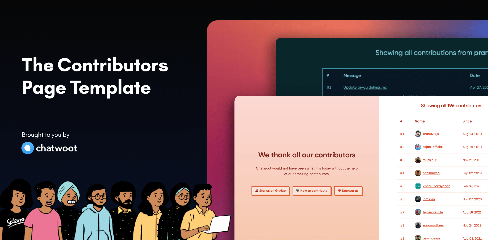

# Contributors Page Template

This project iterates through your entire Github organization and builds a contributors page. Much like https://contributors.chatwoot.com. You can set up a contributors page for your organization quickly.

## ⭐ How it works

GitHub Actions is used to pull the commits and create the contributor database.

- Every 6 hours, a workflow fetches the latest commits from all the repositories and update the contributor/commit data.
- This information is committed back to the repository.
- A leaderboard based on the commit history is created automatically.

Publishing the page is automated using Github Actions.

- Every time a commit is done on the master branch, the gh-pages workflow would run and the branch gh-pages would be updated.

## 👩‍💻 How to set up your own contributors page?

1. Create a repository from this template.
2. Update the `contributors.config.js` file in the repository as follows.

| Key                | Description                                                                                                                                                                                       |
| ------------------ | ------------------------------------------------------------------------------------------------------------------------------------------------------------------------------------------------- |
| basePath           | If you are hosting the page on Github pages, then you would need to configure this to the name of your repository. eg: '/contributors-page'                                                       |
| projectName        | This can be your brand name, project name etc                                                                                                                                                     |
| siteMetadata.title | This title field is used as the title in the generated webpage                                                                                                                                    |
| pageTitle          | Share the title to be shown on the page. eg: 'We thank all our contributors'                                                                                                                      |
| pageDescription    | Along with the title, if you want to show gratitude to the community you can use the description. eg: Chatwoot would not have been what it is today without the help of our amazing contributors. |
| githubLink         | Link to your Github Repo / Organization                                                                                                                                                           |
| contributingGuide  | Link to your documentation on how some one can contribute to the page                                                                                                                             |
| sponsorsLink       | If you have Github sponsor/other sponsor page, you can link here                                                                                                                                  |
| github.org         | Use the organization name you want to include in the contributors page                                                                                                                            |
| github.repoNames   | List the repositories you want to include while creating the contributors page. eg: [chatwoot,chatwoot-mobile-app,charts,docs]                                                                    |
